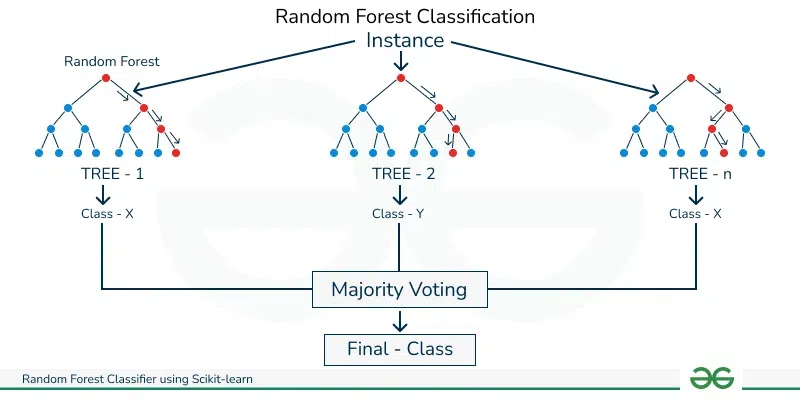

# 🎗️ Meme Kanseri Tahmin Uygulaması (Streamlit)

Makine öğrenmesi ile geliştirilmiş, bir tümörün özelliklerine dayanarak **iyi huylu (Benign)** veya **kötü huylu (Malignant)** olduğunu tahmin eden interaktif bir web uygulaması.

<p align="center">
  
</p>

## 📋 Genel Bakış

Bu proje, Wisconsin Meme Kanseri veri setiyle eğitilmiş, yüksek performanslı bir Random Forest modelini kullanır. Geliştirilen interaktif Streamlit arayüzü sayesinde, araştırmacılar ve öğrenciler, 5 temel tümör özelliğini girerek anında tahmin ve güven skoru alabilirler.

## 🛠️ Teknolojiler

| Teknoloji      | Amaç                  |
|----------------|-----------------------|
| Streamlit 🎈   | İnteraktif Web Arayüzü |
| Scikit-learn 🧠| Makine Öğrenmesi Modeli|
| Pandas 🐼     | Veri Yönetimi         |
| Python 🐍     | Backend               |

## ✨ Uygulama Özellikleri

- **📊 İnteraktif Arayüz:** Kenar çubuğundan değerleri girerek anında tahmin alın.
- **📖 Dahili Kılavuz:** Kullanılan özelliklerin ve modelin metodolojisinin açıklandığı bir sekme.
- **📈 Yüksek Doğruluk:** %95 civarında test doğruluğuna sahip, 5 özellikli optimize edilmiş Random Forest modeli.
- **⚠️ Yasal Uyarı:** Uygulamanın tıbbi teşhis amaçlı olmadığını belirten net bir uyarı.

## 🚀 Uygulamayı Yerel Ortamda Çalıştırma

1.  **Depoyu Klonlayın:**
    ```bash
    git clone [https://github.com/BlackRazor34/Breast_Cancer_RandomForestML.git](https://github.com/BlackRazor34/Breast_Cancer_RandomForestML.git)
    cd Breast_Cancer_RandomForestML
    ```

2.  **Gerekli Kütüphaneleri Yükleyin:**
    ```bash
    pip install -r requirements.txt
    ```

3.  **Streamlit Uygulamasını Başlatın:**
    ```bash
    streamlit run streamlit_app.py
    ```
    Uygulama tarayıcınızda `http://localhost:8501` adresinde otomatik olarak açılacaktır.

---

## 📊 Model Performansı ve Detaylar

Modelimiz, UCI Breast Cancer Wisconsin veri seti kullanılarak eğitilmiş ve test setinde mükemmel bir performans göstermiştir.

<p align="center"></p>

### Sonuçlar

| Metrik | Skor |
|--------|-------|
| **Accuracy** | 96.49% |
| **Precision (Weighted Avg)** | 95.89% |
| **Recall (Weighted Avg)** | 96.49% |
| **F1-Score (Weighted Avg)** | 96.05% |
| **AUC-ROC** | 0.981 |

*(Bu metrikler, orijinal modelin 30 özelliğin tamamı kullanılarak eğitilmiş haline aittir.)*

### Özellik Önem Düzeyleri
Modelin tahmin yaparken en çok dikkate aldığı 5 özellik aşağıda gösterilmiştir. İnteraktif uygulama, bu en önemli özellikler kullanılarak eğitilmiş bir alt model kullanmaktadır.

<p align="center"></p>

1.  Worst perimeter (0.211)
2.  Mean concavity (0.189)
3.  Worst radius (0.162)
4.  Mean radius (0.143)
5.  Worst area (0.128)

### Hata Matrisi (Confusion Matrix)
<p align="center"></p>

- **Doğru Pozitif (TP):** 40 (Kötü huylu olarak doğru tahmin edilen)
- **Yanlış Negatif (FN):** 3 (Kötü huylu iken iyi huylu olarak tahmin edilen)
- **Yanlış Pozitif (FP):** 1 (İyi huylu iken kötü huylu olarak tahmin edilen)
- **Doğru Negatif (TN):** 70 (İyi huylu olarak doğru tahmin edilen)

---

## 🔮 Gelecek Çalışmalar

- Farklı algoritmalarla (SVM, XGBoost, Sinir Ağları) denemeler yapmak.
- Gelişmiş özellik mühendisliği teknikleri uygulamak.
- Modelin yeniden eğitimi için otomatik bir pipeline oluşturmak.

## 📜 Lisans

Bu proje MIT Lisansı ile lisanslanmıştır.