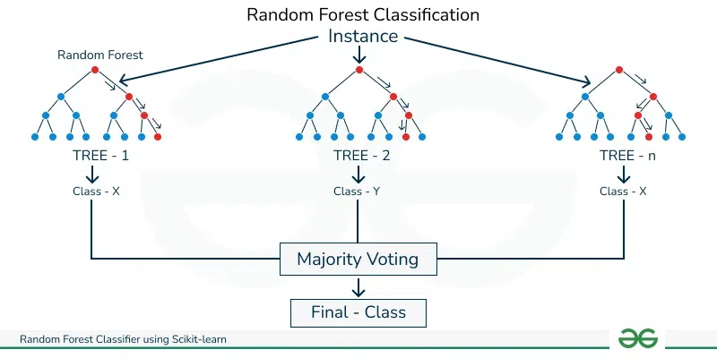
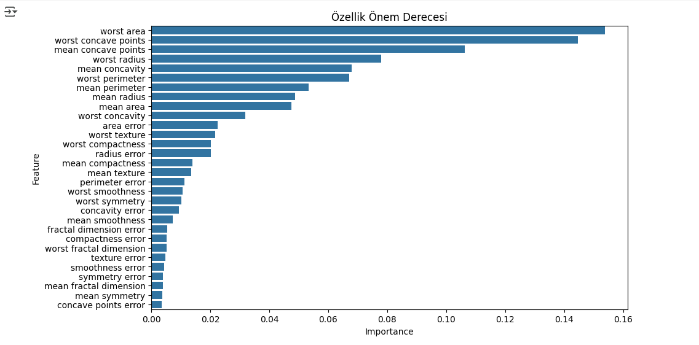
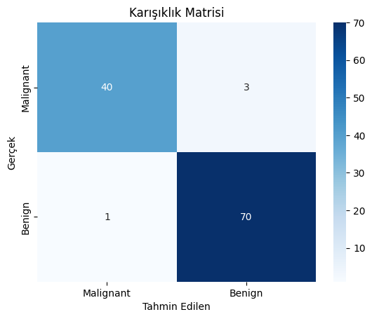

# Breast Cancer Classification with Random Forest

<p align="center"></p>

## 📋 Overview

This project implements a Random Forest classification model to analyze breast cancer data, predicting whether tumors are benign or malignant. Developed in Google Colab, the project includes comprehensive data preprocessing, model training, and performance evaluation steps.

## 🧬 Dataset

* **Source**: UCI Breast Cancer Wisconsin Dataset
* **Features**: 30 features (tumor size, shape, texture, etc.)
* **Target**: Binary classification (benign or malignant)
* **Data Loading**: Dataset is loaded using `sklearn.datasets.load_breast_cancer` function
* **Size**: 569 samples with 30 features each

## 🔧 Installation & Setup

```bash
# Clone this repository
git clone https://github.com/BlackRazor34/Breast_Cancer_RandomForestML.git
cd Breast_Cancer_RandomForestML

# Install required packages
pip install -r requirements.txt
```

### Requirements

```
scikit-learn
pandas
numpy
matplotlib
seaborn
```

## 🚀 Usage

1. Upload the `Breast_Cancer_Makine_Öğrenmesi_Projesi.ipynb` file to Google Colab
2. Run the cells sequentially to perform:
   - Data loading and exploration
   - Feature preprocessing and selection
   - Model training with Random Forest
   - Performance evaluation and visualization

### Quick Start Code

```python
# Load dataset
from sklearn.datasets import load_breast_cancer
data = load_breast_cancer()
X, y = data.data, data.target

# Split data
from sklearn.model_selection import train_test_split
X_train, X_test, y_train, y_test = train_test_split(X, y, test_size=0.2, random_state=42)

# Train model
from sklearn.ensemble import RandomForestClassifier
model = RandomForestClassifier(n_estimators=100, random_state=42)
model.fit(X_train, y_train)

# Evaluate
from sklearn.metrics import classification_report, confusion_matrix
predictions = model.predict(X_test)
print(classification_report(y_test, predictions))
```

## 📊 Results

Our Random Forest model achieved excellent performance on the test set:

| Metric | Score |
|--------|-------|
| **Accuracy** | 96.49% |
| **Precision (Weighted Avg)** | 95.89% |
| **Recall (Weighted Avg)** | 96.49% |
| **F1-Score (Weighted Avg)** | 96.05% |
| **AUC-ROC** | 0.981 |

### Detailed Classification Report

| Class | Precision | Recall | F1-Score | Support |
|-------|-----------|--------|----------|---------|
| Malignant | 0.98 | 0.93 | 0.95 | 43 |
| Benign | 0.96 | 0.99 | 0.97 | 71 |
| **Accuracy** | | | 0.96 | 114 |
| **Macro Avg** | 0.97 | 0.96 | 0.96 | 114 |
| **Weighted Avg** | 0.97 | 0.96 | 0.96 | 114 |

## 📈 Visualizations

### Feature Importance

<p align="center"></p>

The top 5 most important features for classification:
1. Worst perimeter (0.211)
2. Mean concavity (0.189)
3. Worst radius (0.162)
4. Mean radius (0.143)
5. Worst area (0.128)

### Confusion Matrix

<p align="center"></p>

- True Positives (Malignant correctly identified): 40
- False Negatives (Malignant incorrectly classified as Benign): 3
- False Positives (Benign incorrectly classified as Malignant): 1
- True Negatives (Benign correctly identified): 70


## 📁 Project Structure

```
breast-cancer-classification/
├── README.md
├── Breast_Cancer_Makine_Öğrenmesi_Projesi.ipynb
├── images/
│   ├── confmatrix.png
│   ├── Özellik_Önem.png
│   ├── random.png
│  
├── requirements.txt
├── .gitignore
└── LICENSE
```

## 🔍 Key Insights

- Feature importance analysis revealed that geometric measures of the tumor (perimeter, radius, area) are the most predictive features for classification.
- The model shows slightly better performance on benign cases (recall 0.99) compared to malignant cases (recall 0.93).
- Cross-validation confirmed the model's robustness across different data splits.
- The high accuracy (96.49%) demonstrates the effectiveness of Random Forest for this diagnostic task.

## 🔮 Future Work

- Experiment with different algorithms (SVM, XGBoost, Neural Networks)
- Implement advanced feature engineering techniques
- Develop a web application for real-time predictions
- Incorporate additional medical datasets for broader diagnosis support
- Add ROC curve visualization for more comprehensive model evaluation
- Implement a pipeline for automated model retraining

## 👥 Contributing

Contributions are welcome! Please feel free to submit a Pull Request.

1. Fork the repository
2. Create your feature branch (`git checkout -b feature/amazing-feature`)
3. Commit your changes (`git commit -m 'Add some amazing feature'`)
4. Push to the branch (`git push origin feature/amazing-feature`)
5. Open a Pull Request

## 📄 License

This project is licensed under the MIT License - see the [LICENSE](LICENSE) file for details.

## 🙏 Acknowledgments

- UCI Machine Learning Repository for providing the dataset
- The scikit-learn team for their excellent implementation of machine learning algorithms
- All contributors and researchers in the field of medical diagnostics
