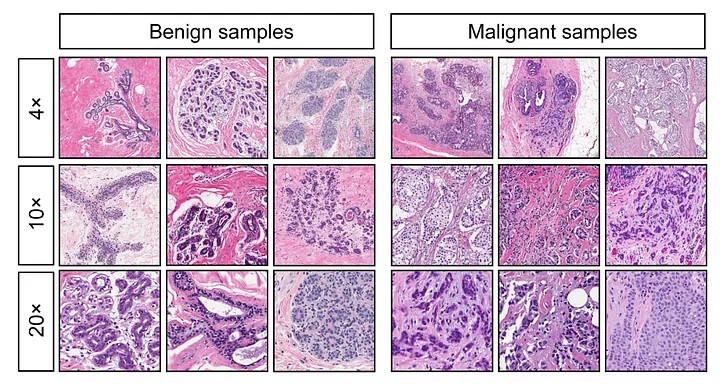
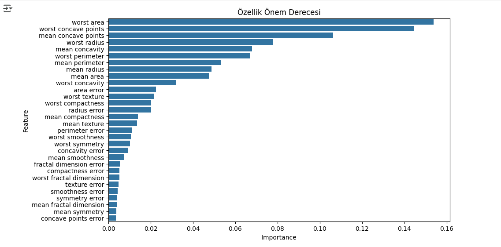
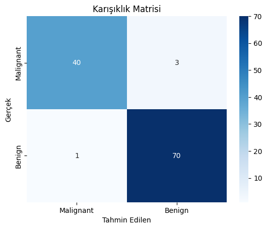

# 🎗️ Meme Kanseri Tahmin Uygulaması (Streamlit & Random Forest)

Bu proje, bir tümörün histolojik özelliklerine dayanarak **iyi huylu (Benign)** veya **kötü huylu (Malignant)** olduğunu sınıflandıran, makine öğrenmesi destekli interaktif bir web uygulamasıdır. Projemde, model geliştirme süreçlerinden canlı bir web uygulamasına geçişin bir örneğini sundum..

  

## 📋 Genel Bakış

Uygulama temel olarak Wisconsin Meme Kanseri veri seti üzerinde eğitilmiş bir **Random Forest** sınıflandırma modelini kullanır. Geliştirdiğim interaktif Streamlit arayüzü, 5 temel tümör özelliğini girdi olarak alarak anında olasılıksal bir tahmin sunar. Bu proje ham veriden son kullanıcıya ulaşan bir makine öğrenmesi ürününün tüm yaşam döngüsünü kapsamaktadır.

**➡️ [Uygulamayı Canlı Deneyin!](https://breastcancerrandomforestml.streamlit.app/)**

## 🛠️ Teknolojiler

| Teknoloji      | Amaç                  |
|----------------|-----------------------|
| Streamlit 🎈   | İnteraktif Web Arayüzü |
| Scikit-learn 🧠| Makine Öğrenmesi Modeli|
| Pandas 🐼     | Veri Manipülasyonu    |
| Numpy 🔢     | Sayısal Hesaplama     |
| Python 🐍     | Backend & Modelleme   |

## ✨ Uygulama Özellikleri

- **📊 İnteraktif Arayüz:** Kullanıcı dostu kenar çubuğu üzerinden gerçek zamanlı tahminler.
- **📖 Dahili Kılavuz:** Model metodolojisi ve kullanılan özellikler hakkında detaylı açıklamalar.
- **📈 Yüksek Doğruluk:** %95 civarında test doğruluğuna sahip, özellik seçimi ile optimize edilmiş Random Forest modeli.
- **⚠️ Yasal Uyarı:** Uygulamanın kullanım amacını ve sınırlarını belirten net bir uyarı.

---

## 🔬 Makine Öğrenmesi İş Akışı ve Model Detayları

Bu bölüm, projenin veri bilimi süreçlerini ve modelin teknik altyapısını detaylandırmaktadır.

### 1. Veri Seti ve Ön İşleme
- **Veri Kaynağı:** UCI Machine Learning Repository - Breast Cancer Wisconsin (Diagnostic) Dataset.
- **Veri Yapısı:** 569 örnek (sample) ve 32 öznitelik (feature) içerir.
- **Ön İşleme:**
    - Veri setinde eksik (missing) veri bulunmadığı teyit edilmiştir.
    - Kategorik olan hedef değişkeni (`diagnosis`), makine öğrenmesi modelinin işleyebilmesi için sayısal formata (`0: Malignant`, `1: Benign`) dönüştürülmüştür.
    - Özellikler arasındaki ölçek farklılıklarının (örn: `area` ve `smoothness`) model performansı üzerindeki olumsuz etkisini gidermek için **`StandardScaler`** kullanılarak standartlaştırma işlemi uygulanmıştır. Bu, her özelliğin ortalamasının 0, standart sapmasının 1 olmasını sağlar.

### 2. Model Seçimi ve Gerekçesi: Random Forest
Bu problem için **Random Forest (Rastgele Orman)** algoritması tercih edilmiştir. Sebepleri:
- **Yüksek Doğruluk:** Genellikle karmaşık sınıflandırma problemlerinde yüksek performans gösterir.
- **Aşırı Öğrenmeye (Overfitting) Karşı Direnç:** Birden çok karar ağacının sonucunu birleştirmesi (ensemble learning), tek bir karar ağacının aşırı öğrenme eğilimini azaltır.
- **Özellik Önemini Belirleme:** Hangi özelliklerin sınıflandırmada daha etkili olduğunu matematiksel olarak hesaplayabilir. Bu, modelin yorumlanabilirliğini artırır.
- **Parametre Ayarı (Hyperparameter Tuning):** Model, `n_estimators=100` (ormanındaki ağaç sayısı) ve `random_state=42` (tekrarlanabilir sonuçlar için) parametreleri ile eğitilmiştir.

### 3. Özellik Seçimi (Feature Selection)
Modelin performansını artırmak, karmaşıklığını azaltmak ve daha hızlı tahminler yapmasını sağlamak amacıyla **Özellik Önem Düzeyleri (Feature Importance)** analizi yapılmıştır. Random Forest modelinin `feature_importances_` özelliği kullanılarak, tahmin üzerinde en çok etkiye sahip olan **ilk 5 özellik** seçilmiştir. Bu özellikler, web uygulamasında kullanılan modelin temelini oluşturur.

### 4. Model Değerlendirme Metrikleri

| Metrik | Skor | Açıklama |
|--------|-------|----------|
| **Accuracy** | 96.49% | Modelin tüm tahminlerinin ne kadarının doğru olduğunu gösterir. |
| **Precision**| 95.89% | Pozitif olarak tahmin edilen vakaların ne kadarının gerçekten pozitif olduğunu belirtir. |
| **Recall** | 96.49% | Gerçekte pozitif olan vakaların ne kadarının model tarafından doğru tespit edildiğini gösterir. Tıbbi tanılarda kritik bir metriktir. |
| **F1-Score** | 96.05% | Precision ve Recall metriklerinin harmonik ortalamasıdır. |
| **AUC-ROC** | 0.981 | Modelin sınıfları ne kadar iyi ayırabildiğinin bir ölçüsüdür. 1'e ne kadar yakınsa o kadar iyidir. |

*(Metrikler, modelin 30 özelliğin tamamı kullanılarak eğitilmiş orijinal haline aittir.)*

---

 
---

## 🚀 Uygulamayı Yerel Ortamda Çalıştırma

1.  **Depoyu Klonlayın:** `git clone https://github.com/BlackRazor34/Breast_Cancer_RandomForestML.git`
2.  **Dizine Gidin:** `cd Breast_Cancer_RandomForestML`
3.  **Kütüphaneleri Yükleyin:** `pip install -r requirements.txt`
4.  **Uygulamayı Başlatın:** `streamlit run streamlit_app.py`

## 🔮 Gelecek Çalışmalar

- **Hiperparametre Optimizasyonu:** `GridSearchCV` veya `RandomizedSearchCV` kullanarak en iyi model parametrelerini bulmak.
- **Alternatif Modeller:** `XGBoost`, `LightGBM` veya `SVM` gibi diğer güçlü algoritmalarla karşılaştırmalı analiz yapmak.
- **CI/CD Pipeline:** Modelin güncellenmesi ve dağıtılması süreçlerini otomatikleştirmek.

## 📜 Lisans

Bu proje MIT Lisansı ile lisanslanmıştır.